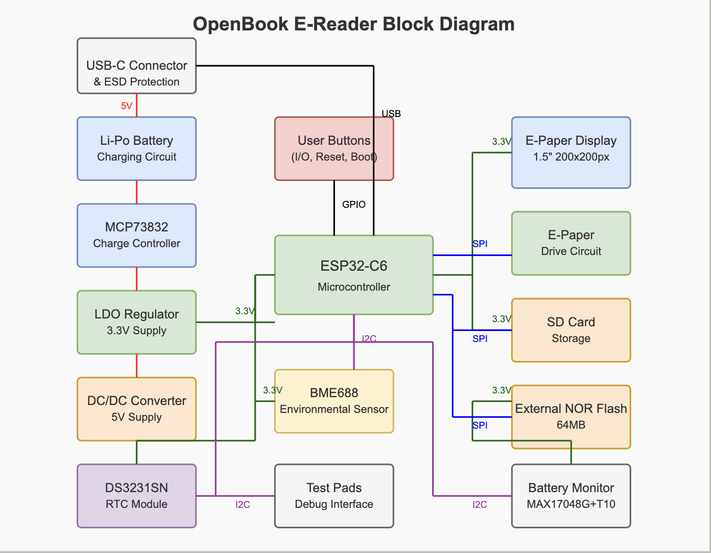

# OpenBook eBook Reader

**OpenBook** is an open-source hardware project focused on developing a portable, affordable, and easily reproducible e-book reader. The device is based on the ESP32-C6 microcontroller and integrates an energy-efficient E-Paper display, microSD card storage, USB-C connectivity for power and data transfer, and a rechargeable Li-Po battery for full portability.

---

## System Architecture

### Block Diagram



This block diagram outlines the functional interconnections between the primary hardware components:

- **ESP32-C6** – Central processing unit and system controller
- **E-Paper Display** – Ultra-low-power screen for text rendering
- **MicroSD Card Reader** – Storage for books and user files
- **RTC (DS3231)** – Real-Time Clock for timestamp management
- **BME688 Sensor** – Environmental sensing (temperature, humidity, pressure, VOCs)
- **Battery Charging Circuit** – Li-Po battery management and protection
- **External Flash (64MB)** – SPI flash memory for caching or extended firmware
- **USB-C Interface** – Power input and data interface
- **LDO Regulator** – Voltage regulation from 5V to 3.3V

---

## Bill of Materials (BOM)

Access the full list of components used in this design, including links to suppliers and datasheets:

[Access the Bill of Materials (CSV)](Manufacturing/BOM.csv)

Official Sources:
- [Comet](https://www.comet.srl.ro)
- [Mouser](https://eu.mouser.com)

---

## Hardware Overview

### Microcontroller Unit (MCU)
- **ESP32-C6** is responsible for all peripheral management, including:
  - User interface rendering on the EPD
  - File access from the SD card
  - Communication with environmental and real-time sensors
  - Power management and control logic

### Power Supply
- Primary power via **USB-C** (5V)
- Voltage converted to **3.3V** using LDO regulator *(e.g., XC6204A33 - IC4)*

### Storage Subsystems
- **MicroSD Card Slot** for storing books and user files
- **SPI Flash (W25Q512JVSIQ)** provides 64MB external storage, suitable for firmware extensions or caching

---

## ESP32-C6 Pin Allocation

| Function                  | ESP32-C6 Pins       | Notes                      |
|---------------------------|---------------------|-----------------------------|
| MicroSD Card              | IO2, IO3, IO4, IO5  | SPI                        |
| E-Paper Display           | IO8, IO9, IO10      | SPI                        |
| Environmental Sensor      | IO6 (SCL), IO7 (SDA)| I²C                        |
| Real-Time Clock (RTC)     | IO6 (SCL), IO7 (SDA)| I²C shared with BME688     |
| External Flash            | IO0, IO1, IO2       | SPI                        |
| Boot Button               | IO9                 | Reset functionality        |
| UI Button (Generic)       | IO10                | Used in navigation logic   |
| UART Debug                | IO20 (TX), IO21 (RX)| Serial communication       |
| EPD Type Select Pins      | IO18, IO19          | Display mode configuration |

---

## Visual Assets

All design-related visual documentation is located in the `Images/` directory:
- [Schematic](Images/schematic.png)
- [PCB Top View](Images/pcb-top.png)
- [PCB Bottom View](Images/pcb-bottom.png)
- [3D Model](Images/3d-model-2.png)
- [Battery](Images/3d-model-3.png)
- [OpenBook Enclosure](Images/3d-model-enclosure.png)

---

## Known Issues

- During the PCB routing phase, two `SMD hole` errors were manually approved after careful review. These were deemed non-critical and acceptable under current design constraints.
---

## Repository Structure

```
OpenBook/
├── Hardware/
│   ├── ebook-reader.sch
│   ├── ebook-reader.brd
├── Manufacturing/
│   ├── gerbers.zip
│   ├── BOM.csv
│   ├── PickAndPlace.zip
├── Mechanical/
│   ├── OpenBook Enclosure.step
│   ├── OpenBook Enclosure.f3z
│   ├── ebook-reader.f3d
├── Images/
│   ├── schematic.png
│   ├── pcb-top.png
│   ├── pcb-bottom.png
│   ├── diagram.png
│   ├── 3d-model-1.png
│   ├── 3d-model-2.png
│   ├── 3d-model-3.png
│   ├── 3d-model-enclosure.png
├── LICENCE
└── README.md
```

---

## Compliance & Design Constraints

This hardware complies with recommended best practices and lab guidelines:
- All SMD components are in 0402 package unless otherwise noted
- Top-layer only component placement
- Via stitching and dual-layer ground planes implemented
- Decoupling capacitors placed optimally
- Antenna placement aligned with RF design rules (ESP32 antenna exposed and isolated)
- No right-angle traces; ERC and DRC checks passed
- Silkscreen includes only component names (not values)
- All test points are labeled clearly in silkscreen

---

## Licensing

This project is licensed under the **[GPL-3.0 license](LICENCE)**, encouraging open development and modification.
