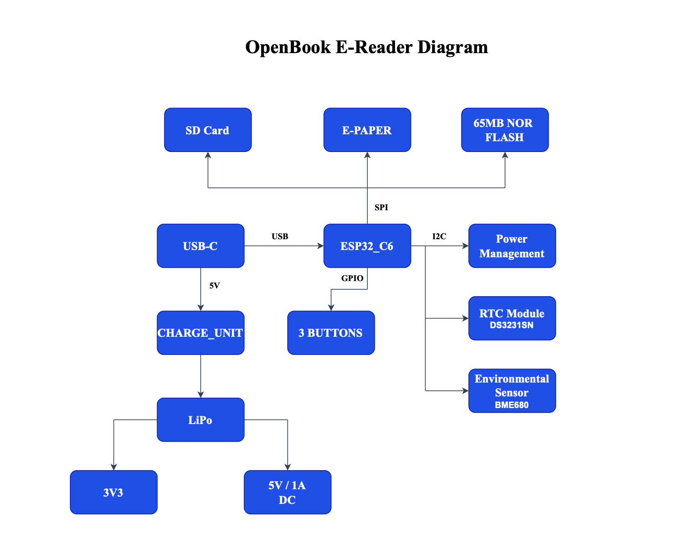

# OpenBook E-Reader Project

This project focuses on creating a portable, affordable, and easily reproducible e-book reader. The device is powered by the **ESP32-C6** microcontroller and features an energy-efficient 
E-Paper display, microSD storage, and a comprehensive power management system.

> [!IMPORTANT]
> This is a homework project for the TSC class (3rd year, 2nd semester).  
- It is a practical assignment created in **Autodesk Fusion 360** using a student license.  
- Educational purposes only.

---

## System Architecture

### Block Diagram

The architecture focuses on a high-efficiency 3.3V power rail and shared communication buses (SPI/I2C):

- **ESP32-C6** – Main MCU managing UI, file systems, and wireless connectivity.
- **E-Paper Display** – 1.5" (200x200px) ultra-low-power screen.
- **Power Management** – Includes the **XC6220** 1A LDO for 3.3V regulation and **MCP73831** for Li-Po charging.
- **Battery Monitoring** – **MAX17048G+T10** fuel gauge for precision voltage and SoC tracking.
- **RTC (DS3231SN)** – Real-time clock with a **CPH3225A Supercapacitor** for power backup.
- **BME680 Sensor** – Integrated environmental sensing (Temp, Humidity, Pressure, Gas).
- **External Flash (64MB)** – Winbond **W25Q512** for extended storage and caching.

---

## Bill of Materials (BOM)

Access the full list of components used in this design, including technical specifications and sourcing links:

[Access the Bill of Materials (CSV)](Manufacturing/BOM.csv)

---

## Hardware Overview

### Power Supply & Charging
The system supports primary power via **USB-C** (5V). Charging is handled by the **MCP73831** controller. A high-performance **XC6220A331MR-G** LDO regulator converts the input/battery voltage to a stable **3.3V** to power the ESP32 and peripherals. Circuit protection includes a **USBLC6-2SC6Y** ESD protector and several **PGB1010** varistors.

### Storage Subsystems
- **MicroSD Card (J4)**: SPI-based interface for external library storage.
- **NOR Flash (U1)**: 512Mb (64MB) SPI flash memory for firmware extensions.

---

## ESP32-C6 Pin Allocation

| Function             | ESP32-C6 Pins       | Notes                        |
|----------------------|---------------------|------------------------------|
| MicroSD Card         | IO2, IO3, IO4, IO5  | SPI                          |
| E-Paper Display      | IO8, IO9, IO10      | SPI                          |
| Shared I2C Bus       | IO6 (SCL), IO7 (SDA)| BME680, RTC, and Fuel Gauge  |
| External Flash       | IO0, IO1, IO2       | SPI (Shared Bus)             |
| Reset Button         | IO9                 | Reset functionality          |
| UI Button (Change)   | IO10                | Navigation/Mode control      |
| UART Debug           | IO20 (TX), IO21 (RX)| Serial communication         |

---

## Visual Assets

All design-related documentation is located in the `Images/` directory:
- [Schematic](Images/schematic.png)
- [PCB Top View](Images/pcb-top.png)
- [PCB Bottom View](Images/pcb-bottom.png)
- [3D Model](Images/3d-model-2.png)
- [OpenBook Enclosure](Images/3d-model-enclosure.png)

---

## Known Issues

- **SMD Hole Errors**: Two minor SMD hole warnings were manually approved during the PCB routing phase. These were verified as non-critical for the final manufacturing.

---

## Compliance & Design Constraints

- All SMD components are **0402** package size (unless specified).
- Optimized for single-side component placement (Top-layer).
- Implemented via stitching and dual-layer ground planes for thermal/EMC stability.
- RF Isolation: The ESP32 antenna area is kept clear of copper and traces.
- Passed all Design Rule Checks (DRC) and Electrical Rule Checks (ERC).

---

## Licensing

This project is licensed under the **[GPL-3.0 license](LICENCE)**.

